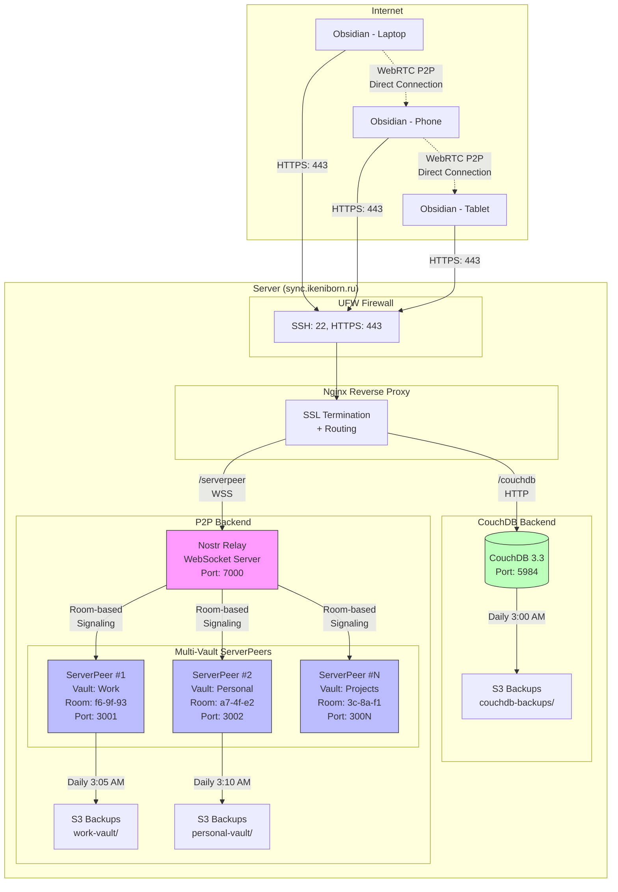
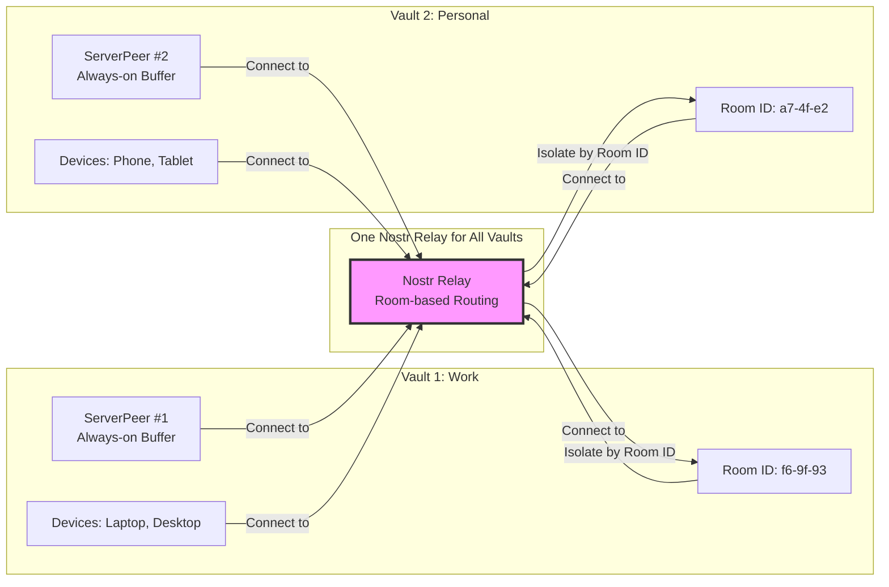

# Notes - Obsidian Sync Server

Production-ready self-hosted sync server для Obsidian с поддержкой двух режимов синхронизации: традиционный CouchDB (client-server) и современный P2P через WebRTC с multi-vault support.

## 📋 Описание

Notes - это **production-ready self-hosted решение** для синхронизации заметок Obsidian с поддержкой двух режимов работы:

**🔄 Sync Backends:**
- **CouchDB** - традиционная client-server синхронизация через HTTP REST API
- **P2P (ServerPeer + Nostr Relay)** - современная peer-to-peer синхронизация через WebRTC

**✨ Key Features:**
- **Multi-vault P2P Support** - неограниченное количество независимых хранилищ
- **Dual Backend** - CouchDB и P2P могут работать одновременно
- **Automated Deployment** - интерактивная настройка и автоматическое развертывание
- **Flexible Networking** - интеграция с существующими сервисами или standalone
- **Secure by Default** - SSL/TLS, UFW firewall, end-to-end encryption (P2P)
- **S3 Backups** - автоматические резервные копии для обоих режимов

**🏗️ Infrastructure:**
- **Nginx** - reverse proxy с SSL termination (существующий или собственный)
- **Docker Compose** - контейнерное развертывание с динамической генерацией конфигураций
- **Nostr Relay** - WebSocket сервер для P2P signaling (один для всех vaults)
- **ServerPeer** - "always-on" буфер для P2P (опционально, по одному контейнеру на vault)

## 🏗️ Архитектура

### Общая архитектура (Dual Backend)



### Режимы работы

**1. CouchDB Mode (Traditional Client-Server)**
- 📍 **Endpoint:** `https://{domain}/couchdb`
- 🔄 **Protocol:** HTTP REST API
- 💾 **Storage:** Document-oriented database
- 📦 **Container:** `notes-couchdb` (port 5984)
- 💿 **Backup:** Database dumps → S3

**2. P2P Mode (WebRTC + ServerPeer Multi-Vault)**
- 📍 **Endpoint:** `wss://{domain}/serverpeer` (WebSocket)
- 🔄 **Protocol:** WebRTC P2P with Nostr signaling
- 💾 **Storage:** Headless vaults (file-based, per vault)
- 📦 **Containers:**
  - `notes-nostr-relay` - один WebSocket сервер для всех vaults (port 7000)
  - `notes-serverpeer-{vault}` - N контейнеров для N vaults (ports 3001+)
- 💿 **Backup:** Vault archives → S3 (per vault)
- 🔐 **Isolation:** Unique Room ID + Passphrase per vault

**3. Dual Mode (Both)**
- Оба backend развернуты одновременно
- Разные endpoint'ы: `/couchdb` и `/serverpeer`
- Независимые backups с разными префиксами

### P2P Multi-Vault Architecture

**Ключевые компоненты:**



**Как работает изоляция:**
1. **Один Nostr Relay** обслуживает все vaults
2. **Unique Room ID** для каждого vault (например: `f6-9f-93`, `a7-4f-e2`)
3. **Relay маршрутизирует** сообщения только peer'ам из того же Room ID
4. **Passphrase** обеспечивает end-to-end шифрование данных
5. **Devices не видят** peer'ы из других vault'ов

### Network Modes

**Shared Mode (интеграция с существующими сервисами):**
```
Docker Network: my_app_network (existing)
├── nginx (existing)
├── notes-couchdb
├── notes-nostr-relay
├── notes-serverpeer-work
├── notes-serverpeer-personal
└── [другие сервисы]
```

**Isolated Mode (standalone deployment):**
```
Docker Network: obsidian_network (auto-created, 172.24-31.0.0/16)
├── notes-nginx (собственный)
├── notes-couchdb
├── notes-nostr-relay
├── notes-serverpeer-work
└── notes-serverpeer-personal
```

### Backend Comparison

| Feature | CouchDB | P2P (ServerPeer) |
|---------|---------|------------------|
| **Архитектура** | Client-Server | Peer-to-Peer (WebRTC) |
| **Протокол** | HTTP REST API | WebSocket + WebRTC |
| **Хранение** | Database (CouchDB) | File-based vaults |
| **Multi-vault** | One database | Multiple isolated vaults |
| **Синхронизация** | Через сервер | Прямая между устройствами + буфер |
| **Offline Support** | Да (replicate when online) | Да (ServerPeer как буфер) |
| **Encryption** | Transport (TLS) | End-to-end (Passphrase) |
| **Backup** | Database dumps | Vault archives |
| **Resource Usage** | Medium | Low per vault |
| **Complexity** | Simple | Medium (multi-container) |

## 🚀 Быстрый старт

### Production (Рекомендуется)

**Шаг 1: Установка зависимостей и UFW**
```bash
cd ~/obsidian-sync
sudo ./install.sh
```

Установит:
- Docker и Docker Compose (если не установлены)
- UFW firewall (разрешены только SSH:22 и HTTPS:443)
- Python 3 и boto3 (для S3 backups)
- Проверит nginx (детекция существующего)

**Шаг 2: Конфигурация**
```bash
./setup.sh
```

Настроит:
- **Выбор sync бэкенда** (CouchDB only / ServerPeer only / Both)
- **Multi-vault setup** (для P2P):
  - Вопрос: "How many vaults do you want to configure?"
  - Для каждого vault: имя (Work, Personal, Projects...)
  - Auto-генерация уникальных Room ID и Passphrase
  - Sequential ports (3001, 3002, 3003...)
- Генерация безопасных credentials:
  - CouchDB: COUCHDB_PASSWORD (256-bit)
  - P2P: VAULT_N_ROOMID + VAULT_N_PASSPHRASE (128-bit per vault)
- Запрос NOTES_DOMAIN (например: notes.example.com)
- Запрос CERTBOT_EMAIL (для Let's Encrypt уведомлений)
- Запрос S3 credentials (опционально)
- Создание cron/systemd jobs для автоматических backups:
  - CouchDB: daily at 3:00 AM
  - ServerPeer vaults: daily at 3:05 AM (per vault)

**Шаг 3: Deployment**
```bash
./deploy.sh
```

Выполнит:
- Nginx setup (детекция/интеграция или запуск своего)
- SSL сертификаты (Let's Encrypt через certbot)
- **Backend-specific deployment:**
  - CouchDB: deploy notes-couchdb
  - ServerPeer:
    - Deploy notes-nostr-relay (один для всех vaults)
    - Generate docker-compose.serverpeers.yml (N services)
    - Deploy N ServerPeer containers (один на vault)
  - Both: deploy всё вместе
- Валидация всех компонентов (health checks)
- Генерация документации с параметрами подключения

**Доступ после развертывания:**

*CouchDB Mode:*
- HTTPS: https://notes.example.com/couchdb
- Credentials: `admin` / [COUCHDB_PASSWORD из /opt/notes/.env]

*P2P Mode:*
- WebSocket: wss://notes.example.com/serverpeer
- Параметры подключения: см. `/opt/notes/docs/VAULT-PARAMETERS.md`
- Или запустите: `ssh server "cd /opt/notes && bash scripts/generate-vault-docs.sh"`

### Migration from Previous Versions

Для обновления с версии 1.x на 2.0 (с новой сетевой архитектурой), см. детальный [Migration Guide](docs/migration-guide.md).

**Краткая инструкция:**
```bash
# 1. Backup текущей конфигурации
sudo cp /opt/notes/.env /opt/notes/.env.backup

# 2. Pull изменений
git pull origin dev
git checkout feature/network-isolation-refactor

# 3. Обновить .env (добавить сетевые переменные)
cat >> /opt/notes/.env <<EOF
NETWORK_MODE=shared
NETWORK_NAME=my_app_network
NETWORK_EXTERNAL=true
NGINX_CONTAINER_NAME=nginx
NGINX_CONFIG_DIR=/etc/nginx/conf.d
COUCHDB_CONTAINER_NAME=notes-couchdb
EOF

# 4. Re-deploy
sudo ./deploy.sh
```


## 📂 Структура файлов

```
notes/
├── docker-compose.notes.yml      # CouchDB docker-compose
├── docker-compose.serverpeer.yml # ServerPeer docker-compose
├── .env.example                  # Template переменных
├── README.md                     # Эта документация
├── install.sh                    # Установка зависимостей
├── setup.sh                      # Конфигурация (/opt/notes/.env) + выбор бэкенда
├── deploy.sh                     # Production deployment (conditional)
├── local.ini                     # CouchDB server config
├── serverpeer/                   # ServerPeer Docker build
│   └── Dockerfile                # Multi-stage build (Deno + Node.js)
├── templates/                    # Nginx templates
│   ├── couchdb.conf.template     # CouchDB HTTP proxy
│   └── serverpeer.conf.template  # ServerPeer WebSocket proxy
└── scripts/                      # Вспомогательные скрипты
    ├── couchdb-backup.sh         # CouchDB backup script
    ├── serverpeer-backup.sh      # ServerPeer backup script (NO CouchDB)
    ├── test-serverpeer.sh        # ServerPeer integration tests
    ├── nginx-setup.sh            # Nginx configuration (backend-aware)
    ├── ssl-setup.sh              # SSL/certbot setup
    ├── ufw-setup.sh              # Firewall configuration
    ├── network-manager.sh        # Network configuration helper
    ├── s3_upload.py              # S3 upload (backend-agnostic)
    └── ... (other utilities)
```

## 🔧 Требования

### Обязательные
- Docker 20.10+
- Docker Compose v2+
- Python 3 + boto3 (для S3 backups, опционально)

### Опциональные (для Shared Mode)
- Существующий nginx контейнер (docker или systemd)
- Существующая Docker сеть

### Проверка зависимостей
```bash
# Проверить Docker
docker --version
docker compose version

# Проверить существующие nginx контейнеры (опционально)
docker ps | grep nginx

# Проверить существующие сети (опционально)
docker network ls

# Проверить CouchDB после deployment
docker ps | grep notes-couchdb
```

## 🛠️ Управление

### Запуск
```bash
cd notes/
docker compose -f docker-compose.notes.yml up -d
```

### Остановка
```bash
cd notes/
docker compose -f docker-compose.notes.yml down
```

### Логи
```bash
# Имя контейнера из .env: COUCHDB_CONTAINER_NAME (default: notes-couchdb)
docker logs notes-couchdb
docker logs -f notes-couchdb  # Follow mode
```

### Health check
```bash
# CouchDB health endpoint
curl http://localhost:5984/_up

# Через nginx (требует настройки NOTES_DOMAIN в /etc/hosts)
curl http://notes.localhost/_up
```

### Backup
```bash
# Manual backup
cd /opt/notes
bash scripts/couchdb-backup.sh

# Backups сохраняются в: /opt/notes/backups/
```

## ⚙️ Конфигурация

### CouchDB Settings (`local.ini`)

```ini
[couchdb]
single_node=true                    # Single-node mode
max_document_size = 50000000        # 50MB (для attachments)

[chttpd]
require_valid_user = true           # Authentication required
max_http_request_size = 4294967296  # 4GB

[httpd]
enable_cors = true                  # CORS для Obsidian

[cors]
origins = app://obsidian.md,capacitor://localhost,http://localhost
```

### Environment Variables

Все переменные в `/opt/notes/.env`:

| Переменная | Описание | Пример |
|------------|----------|--------|
| `COUCHDB_USER` | CouchDB admin user | `admin` |
| `COUCHDB_PASSWORD` | CouchDB admin password (auto-generated) | `abc123...` (32 hex) |
| `NOTES_DOMAIN` | Subdomain for nginx | `notes.localhost` |
| `NOTES_DATA_DIR` | Data directory | `/opt/notes/data` |
| `NOTES_BACKUP_DIR` | Backups directory | `/opt/notes/backups` |
| `COUCHDB_PORT` | CouchDB port | `5984` |

## 🔐 Security

### Firewall (UFW)
Настроен автоматически через `install.sh`:
- ✅ SSH (22) - разрешен
- ✅ HTTPS (443) - разрешен
- ❌ HTTP (80) - **закрыт** (открывается только для certbot renewal)
- ❌ Все остальные порты - закрыты

### SSL/TLS
- Автоматическое получение сертификатов через Let's Encrypt
- Auto-renewal с UFW hooks (безопасное управление портом 80)
- Современные TLS настройки (TLSv1.2+, HSTS)
- HTTP → HTTPS редирект

### CouchDB
- Порт 5984 bind только к 127.0.0.1 (не доступен извне)
- Доступ **только** через nginx reverse proxy
- Безопасный пароль (генерируется автоматически)
- Authentication required

### Password Generation
`setup.sh` автоматически генерирует безопасный пароль:
```bash
openssl rand -hex 32  # 64 characters (256 bits)
```

## 💾 Automatic Backups

Настраиваются через `setup.sh` (опционально):
- **Расписание:** Ежедневно в 3:00 AM
- **Локально:** /opt/notes/backups/ (хранится 7 дней)
- **S3:** Загрузка в S3-compatible storage (опционально)
- **Логи:** /opt/notes/logs/backup.log

### Ручной запуск backup
```bash
bash /opt/notes/scripts/couchdb-backup.sh
```

### Проверка статуса backups
```bash
# Локальные backups
ls -lh /opt/notes/backups/

# Последний лог
tail -f /opt/notes/logs/backup.log

# Cron job
crontab -l | grep couchdb-backup
```

## 🐛 Troubleshooting

### Ошибка: "Network not found"
```bash
# Проверьте доступные сети
docker network ls

# Для shared mode: убедитесь что сеть существует
docker network inspect my_app_network

# Для isolated mode: сеть создается автоматически при deploy
```

### Ошибка: "env_file: /opt/notes/.env: no such file"
```bash
# Запустите setup для создания .env
cd ~/obsidian-sync
bash setup.sh
```

### CouchDB не отвечает на health check
```bash
# Проверить логи (имя контейнера из .env)
docker logs notes-couchdb

# Проверить порт
netstat -tuln | grep 5984

# Рестарт
docker compose -f docker-compose.notes.yml restart
```

### Backup fails
```bash
# Проверить права доступа
ls -la /opt/notes/backups/

# Создать директорию если не существует
sudo mkdir -p /opt/notes/backups
sudo chown -R $(whoami):$(whoami) /opt/notes
```

## 📚 Интеграция с Obsidian

### Установка плагина
1. Obsidian → Settings → Community Plugins
2. Поиск: "Self-hosted LiveSync"
3. Install & Enable

### Настройка синхронизации
1. Plugin Settings → Setup wizard
2. URI: `http://notes.localhost` (dev) или `https://notes.yourdomain.com` (prod)
3. Username: `admin`
4. Password: из `/opt/notes/.env` (`COUCHDB_PASSWORD`)
5. Database name: `obsidian` (или custom)

### Первая синхронизация
1. Choose "Remote database to Local" или "Local to Remote"
2. Sync → Start
3. Wait for initial sync to complete

## 🔄 Updates

### Обновление Notes
```bash
# Pull latest changes
cd ~/familyBudget
git pull

# Redeploy notes (production)
cd notes/
./deploy.sh

# Redeploy notes (development)
docker compose -f docker-compose.notes.yml pull
docker compose -f docker-compose.notes.yml up -d
```

## 📊 Monitoring

### Resource Usage
```bash
docker stats familybudget-notes-couchdb
```

**Лимиты:**
- CPU: 0.5 cores max, 0.1 cores reserved
- Memory: 512MB max, 128MB reserved

### Disk Usage
```bash
du -sh /opt/notes/data
du -sh /opt/notes/backups
```

## 📖 Documentation

### Architecture Documentation

Comprehensive YAML-based architecture documentation is available at `docs/architecture/`. This knowledge graph documents all components, scripts, workflows, and architectural patterns.

**Start here:** [`docs/architecture/index.yml`](docs/architecture/index.yml)

**What's documented:**
- Infrastructure components (CouchDB, Nginx, Docker, UFW, Certbot, S3)
- Application components (Backup, Deployment, Monitoring)
- Scripts (deployment, helpers, testing)
- Workflows (deployment flow, network setup, SSL renewal, backup)
- Architectural patterns (flexible networking, nginx integration)
- Security architecture and threat model
- Network topology diagrams (shared/isolated modes)
- Configuration files structure

**For developers:** Use the knowledge graph to understand component relationships, script dependencies, and execution flows. Each YAML file contains detailed technical information with cross-references to related components.

## 🔗 Links

- [Architecture Documentation](docs/architecture/index.yml) - YAML knowledge graph
- [Product Requirements (PRD)](docs/prd/obsidian-sync-server.md) - Full specification
- [CouchDB Documentation](https://docs.couchdb.org/)
- [Obsidian Self-hosted LiveSync](https://github.com/vrtmrz/obsidian-livesync)
- [Family Budget Main App](../README.md)

---

**Version:** 5.1.0
**Last Updated:** 2025-11-16
